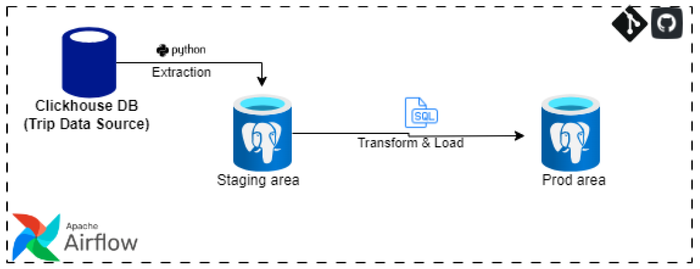

# Modular ClickHouse ETL Pipeline

This project provides a comprehensive Modular Data ETL Pipeline solution to extract Divy Trips (NYC cab trip) data from a 
ClickHouse database to an on-premises PostgreSQL database, transform the extracted data and load it to an on-premises 
PostgreSQL Enterprise Data Warehouse. 

The pipeline leverages a combination of tech stack tools such as Python, PostgreSQL and Apache Airflow. 

## Table of Contents

- [Overview](#overview)
- [Architecture](#architecture)
- [Prerequisites](#prerequisites)
- [Source System](#source-system)
- [Environment Variables](#environment-variables)

## Overview
Divy Trips is a cab-hailing company in New York City. From 2009 to 2016, Divy collected individual trip data, which is large and stored in a Clickhouse database. 
The business seeks to generate monthly aggregated data and load it in an Enterprise Data Warehouse to facilitate business analytics and informed decision-making.

The pipeline is designed to:

1. Extract data from the Clickhouse database using a ClickHouse Connect client instance to connect to a ClickHouse Cloud service.
2. Store the raw data in a staging area on an on-prem PostgreSQL DBMS.
3. Transform the data and develop aggregate tables to show the following monthly metrics (average trip count, average trip duration, average trip fare) based on business requirements.
4. Load the aggregated data into the Production Environment (Enterprise Data Warehouse) on an on-prem PostgreSQL DBMS for analytics and querying.
5. Orchestrate the ETL pipeline using Apache Airflow for Incremental Loading.

## Architecture

1. **Clickhouse Database**: Source of the data.
2. **PostgreSQL DBMS**: Staging Area.
3. **PostgreSQL DBMS**: Production Area/EDW (Data warehousing and analytics)
4. **Apache Airflow**: Orchestrates the ETL process and manages task distribution.

## Prerequisites
- Clickhouse Database Connection Credentials.
- PostgreSQL Database Connection Credentials.
- Docker Desktop Installation
- Docker Image File for Apache Airflow
- Apache Airflow Login Credentials
- Python 3.9 or higher

## Source System

The data source for this pipeline is a ClickHouse database accessible at the following URL:
- [ClickHouse Play](https://github.demo.trial.altinity.cloud:8443/play)

## Environment Variables

To reproduce the pipeline, an environment variable file (`.env`) is required with credentials for both the ClickHouse and PostgreSQL databases. The `.env` file should have the following format:

ClickHouse Credentials
- `ch_host = <your_clickhouse_host>`
- `ch_port = <your_clickhouse_port>`
- `ch_user = <your_clickhouse_user>`
- `ch_password = <your_clickhouse_password>`

PostgreSQL Credentials
- `pg_user = <your_postgres_user>`
- `pg_password = <your_postgres_password>`
- `pg_dbname = <your_postgres_dbname>`
- `pg_port = <your_postgres_port>`
- `pg_host = <your_postgres_host>`

Airflow Credentials
- `AIRFLOW_UID = <your_AIRFLOW_UID>`
- `_AIRFLOW_WWW_USER_USERNAME = <your__AIRFLOW_WWW_USER_USERNAME>`
- `__AIRFLOW_WWW_USER_PASSWORD = <your___AIRFLOW_WWW_USER_PASSWORD>`

